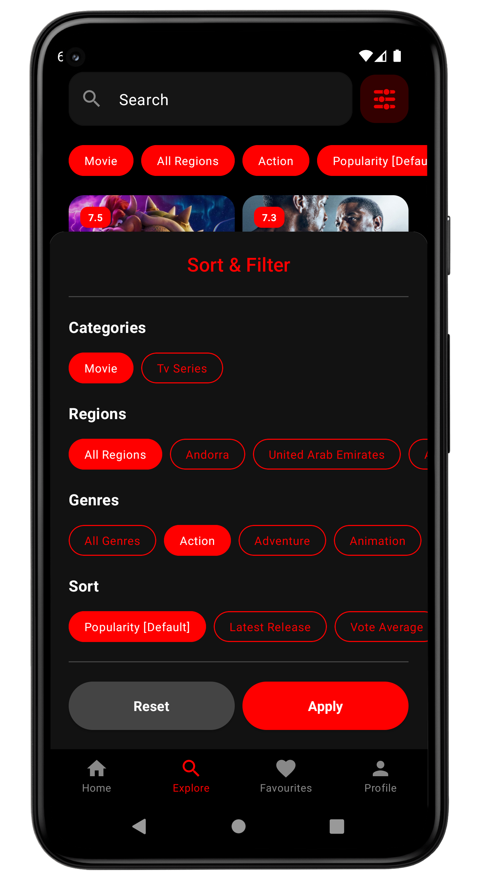

# Mova

Highly modularized native Android Application using Jetpack Compose.

### Screenshots

  
 
 
 
 
 
 

### License

This software is licensed under GNU GPL 3.0. Any derivative works must follow the same open-source license. 