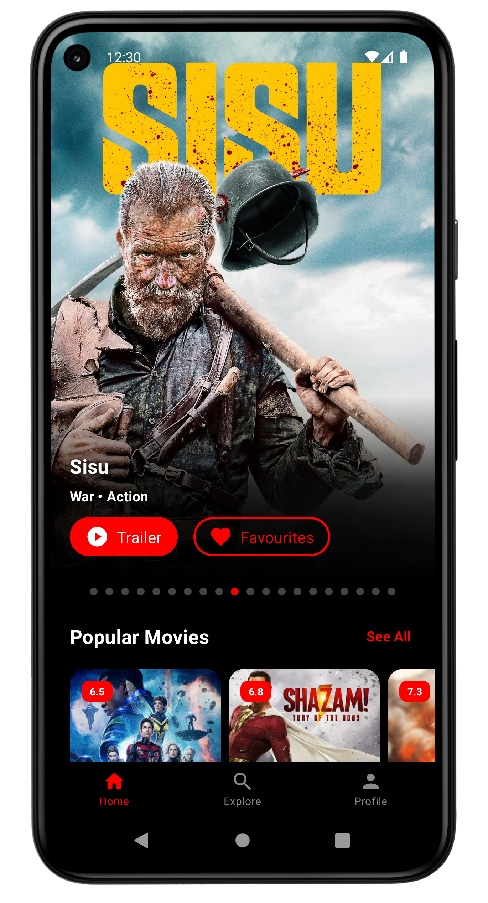

<a name="readme-top"></a>

[![Contributors][contributors-shield]][contributors-url]
[![Forks][forks-shield]][forks-url]
[![Stargazers][stars-shield]][stars-url]
[![Issues][issues-shield]][issues-url]
<!-- [![MIT License][license-shield]][license-url] -->
[![LinkedIn][linkedin-shield]][linkedin-url]


<!-- PROJECT LOGO -->
<br />
<div align="center">

  <a href="https://github.com/othneildrew/Best-README-Template">
    
  </a>

  <a href="https://github.com/othneildrew/Best-README-Template">
    
  </a>

  <h3 align="center">Mova</h3>

  <p align="center">
    Movie Showcase App Using Compose Multiplatform
    <br />
    <a href="https://github.com/barabasizsolt/Mova"><strong>Explore the docs »</strong></a>
    <br />
    <br />
    <a href="https://github.com/barabasizsolt/Mova">View Demo</a>
    ·
    <a href="https://github.com/barabasizsolt/Mova/issues">Report Bug</a>
    ·
    <a href="https://github.com/barabasizsolt/Mova/issues">Request Feature</a>
  </p>
</div>


<!-- TABLE OF CONTENTS -->
<details>
  <summary>Table of Contents</summary>
  <ol>
    <li>
      <a href="#about-the-project">About The Project</a>
      <ul>
        <li><a href="#tech-stack">Tech Stack</a></li>
      </ul>
    </li>
    <li>
      <a href="#getting-started">Getting Started</a>
      <ul>
        <li><a href="#set-up-the-environment">Set up the environment</a></li>
        <li><a href="#check-your-environment">Check your environment</a></li>
      </ul>
    </li>
    <li>
      <a href="#examine-the-project-structure">Examine the project structure</a>
      <ul>
        <li><a href="#kmm">kmm</a></li>
        <li><a href="#app">app</a></li>
        <li><a href="#iosapp">iosApp</a></li>
      </ul>
    </li>
    <li>
      <a href="#run-the-application">Run the Application</a>
      <ul>
        <li><a href="#on-android">On Android</a></li>
        <li>
          <a href="#on-ios">On IOS</a>
          <ul>
            <li><a href="#running-on-a-simulator">Running on a simulator</a></li>
            <li><a href="#running-on-a-real-device">Running on a real device</a></li>
        </ul>
        </li>
      </ul>
    </li>
    <li><a href="#screenshots">Screenshots</a></li>
    <li><a href="#roadmap">Roadmap</a></li>
    <li><a href="#contributing">Contributing</a></li>
    <li><a href="#license">License</a></li>
    <li><a href="#contact">Contact</a></li>
  </ol>
</details>


<!-- ABOUT THE PROJECT -->
## About The Project

 
 

**Mova** is a multiplatform movie showcase application that allows users to search and explore movies using **[The Movie Database API](https://developers.themoviedb.org/3/getting-started/introduction)**. It also provides authentication features, allowing users to create and manage their accounts within the app. The app is built using **[Compose Multiplatform](https://github.com/JetBrains/compose-multiplatform-ios-android-template)**, a UI toolkit from JetBrains that enables the creation of cross-platform native applications using a single codebase.

<p align="right">(<a href="#readme-top">back to top</a>)</p>


### Tech Stack
* **[Compose Multiplatform](https://github.com/JetBrains/compose-multiplatform-ios-android-template)**
* **[Koin](https://insert-koin.io/)**
* **[Ktor](https://ktor.io/)**
* **[Voyager - Navigation Library](https://github.com/adrielcafe/voyager)**
* **[Firebase Authentication](https://firebase.google.com/docs/auth)**
* **[Coil - Android Only](https://github.com/coil-kt/coil)**
* **[Beagle - Debug/Android Only](https://github.com/pandulapeter/beagle)**

### UI Design Inspiration
* **[Mova - Movie Streaming App UI Kit Community Edition](https://www.figma.com/community/file/1216311757237992126)**

<p align="right">(<a href="#readme-top">back to top</a>)</p>


<!-- GETTING STARTED -->
## Getting Started

### Set up the environment

> **Warning**
> You need a Mac with macOS to write and run iOS-specific code on simulated or real devices.
> This is an Apple requirement.
To work with this project, you need the following:

* A machine running a recent version of macOS
* [Xcode](https://apps.apple.com/us/app/xcode/id497799835)
* [Android Studio](https://developer.android.com/studio)
* The [Kotlin Multiplatform Mobile plugin](https://plugins.jetbrains.com/plugin/14936-kotlin-multiplatform-mobile)
* The [CocoaPods dependency manager](https://kotlinlang.org/docs/native-cocoapods.html)

### Check your environment

Before you start, use the [KDoctor](https://github.com/Kotlin/kdoctor) tool to ensure that your development environment is configured correctly:

1. Install KDoctor with [Homebrew](https://brew.sh/):

    ```text
    brew install kdoctor
    ```

2. Run KDoctor in your terminal:

    ```text
    kdoctor
    ```

   If everything is set up correctly, you'll see valid output:

   ```text
   Environment diagnose (to see all details, use -v option):
   [✓] Operation System
   [✓] Java
   [✓] Android Studio
   [✓] Xcode
   [✓] Cocoapods
   
   Conclusion:
     ✓ Your system is ready for Kotlin Multiplatform Mobile development!
   ```

Otherwise, KDoctor will highlight which parts of your setup still need to be configured and will suggest a way to fix them.

## Examine the project structure

Open the project in Android Studio and switch the view from **Android** to **Project** to see all the files and targets belonging to the project:


The App includes 3 main modules:

### kmm

This is a Kotlin module that contains the logic common for both Android and iOS applications,

Under the `kmm` you can find the following modules:
- `kmm/service`
    Provides data for the application. This is the module witch contains third-party service intergation, like [Firebase](https://firebase.google.com/).


- `kmm/domain`
    Responsible for the app's business logic, contains the UseCases.

- `kmm/shared:`
    This is a Kotlin module that contains the logic common for both Android and iOS applications, that is, the shared code & entry point between platforms.
    \
    This `kmm/shared` module is also where is the Compose Multiplatform code.
    In `kmm/shared/src/commonMain/kotlin/`, you can find the shared `@Composable` functions for the app.
    \
    It uses Gradle as the build system. You can add dependencies and change settings in `kmm/shared/build.gradle.kts`.
    The `kmm/shared` module builds into an Android library and an iOS framework.

### app

This is a Kotlin module that builds into an Android application. It uses Gradle as the build system.
The `android` module depends on and uses the `kmm/shared` module as a regular Android library.

### iosApp

This is an Xcode project that builds into an iOS application.
It depends on and uses the `kmm/shared` module as a CocoaPods dependency.

## Run the Application

### On Android

To run the application on an Android emulator:

1. Ensure you have an Android virtual device available. Otherwise, [create one](https://developer.android.com/studio/run/managing-avds#createavd).
2. In the list of run configurations, select `app`.
3. Choose your virtual device and click **Run**:

   
   <br>
   

<details>
  <summary>Alternatively, use Gradle</summary>

To install an Android application on a real Android device or an emulator, run `./gradlew installDebug` in the terminal.

</details>

### On iOS

#### Running on a simulator

To run the application on an iOS simulator in Android Studio, modify the `iosApp` run configuration:

1. In the list of run configurations, select **Edit Configurations**:

   

2. Navigate to **iOS Application** | **iosApp**.
3. In the **Execution target** list, select your target device. Click **OK**:

   

4. The `iosApp` run configuration is now available. Click **Run** next to your virtual device:


#### Running on a real device

You can run a Compose Multiplatform application on a real iOS device for free.
To do so, you'll need the following:

* The `TEAM_ID` associated with your [Apple ID](https://support.apple.com/en-us/HT204316)
* The iOS device registered in Xcode

> **Note**
> Before you continue, we suggest creating a simple "Hello, world!" project in Xcode to ensure you can successfully run apps on your device.
> You can follow the instructions below or watch this [Stanford CS193P lecture recording](https://youtu.be/bqu6BquVi2M?start=716&end=1399).
<details>
<summary>How to create and run a simple project in Xcode</summary>

1. On the Xcode welcome screen, select **Create a new project in Xcode**.
2. On the **iOS** tab, choose the **App** template. Click **Next**.
3. Specify the product name and keep other settings default. Click **Next**.
4. Select where to store the project on your computer and click **Create**. You'll see an app that displays "Hello, world!" on the device screen.
5. At the top of your Xcode screen, click on the device name near the **Run** button.
6. Plug your device into the computer. You'll see this device in the list of run options.
7. Choose your device and click **Run**.

</details>

##### Finding your Team ID

In the terminal, run `kdoctor --team-ids` to find your Team ID.
KDoctor will list all Team IDs currently configured on your system, for example:

```text
3ABC246XYZ (Max Sample)
ZABCW6SXYZ (SampleTech Inc.)
```

<details>
<summary>Alternative way to find your Team ID</summary>

If KDoctor doesn't work for you, try this alternative method:

1. In Android Studio, run the `iosApp` configuration with the selected real device. The build should fail.
2. Go to Xcode and select **Open a project or file**.
3. Navigate to the `iosApp/iosApp.xcworkspace` file of your project.
4. In the left-hand menu, select `iosApp`.
5. Navigate to **Signing & Capabilities**.
6. In the **Team** list, select your team.

If you haven't set up your team yet, use the **Add account** option and follow the steps.

</details>

To run the application, set the `TEAM_ID`:

1. In the template, navigate to the `iosApp/Configuration/Config.xcconfig` file.
2. Set your `TEAM_ID`.
3. Re-open the project in Android Studio. It should show the registered iOS device in the `iosApp` run configuration.

<!-- USAGE EXAMPLES -->
## Screenshots

 
 
 
 
 
 
 
 
 

<p align="right">(<a href="#readme-top">back to top</a>)</p>


<!-- ROADMAP -->
## Roadmap

- [x] Convert the existing android app to Kotlin Multiplatform
- [x] Convert the UI into Compose Multiplatform
- [x] Convert Firebase into Multiplatform
- [x] Handle back navigation on IOS
- [ ] Implement Social Login (Google/Facebook) on IOS
- [ ] Improve Resources with MOKO library
- [ ] Implement Offline support using SQLDelight
- [ ] Implement for Web

See the [open issues](https://github.com/othneildrew/Best-README-Template/issues) for a full list of proposed features (and known issues).

<p align="right">(<a href="#readme-top">back to top</a>)</p>


<!-- CONTRIBUTING -->
## Contributing

Contributions are what make the open source community such an amazing place to learn, inspire, and create. Any contributions you make are **greatly appreciated**.

If you have a suggestion that would make this better, please fork the repo and create a pull request. You can also simply open an issue with the tag "enhancement".
Don't forget to give the project a star! Thanks again!

1. Fork the Project
2. Create your Feature Branch (`git checkout -b feature/AmazingFeature`)
3. Commit your Changes (`git commit -m 'Add some AmazingFeature'`)
4. Push to the Branch (`git push origin feature/AmazingFeature`)
5. Open a Pull Request

<p align="right">(<a href="#readme-top">back to top</a>)</p>


<!-- LICENSE -->
## License

This software is licensed under GNU GPL 3.0. Any derivative works must follow the same open-source license. 

<p align="right">(<a href="#readme-top">back to top</a>)</p>


<!-- CONTACT -->
## Contact

Your Name - [@zsolt_barabasi](https://twitter.com/zsolt_barabasi) - barabasi.robert.zsolt@gmail.com

Project Link: [https://github.com/barabasizsolt/Mova](https://github.com/barabasizsolt/Mova)

<p align="right">(<a href="#readme-top">back to top</a>)</p>


<!-- MARKDOWN LINKS & IMAGES -->
<!-- https://www.markdownguide.org/basic-syntax/#reference-style-links -->
[contributors-shield]: https://img.shields.io/github/contributors/barabasizsolt/Mova.svg?style=for-the-badge
[contributors-url]: https://github.com/barabasizsolt/Mova/graphs/contributors

[forks-shield]: https://img.shields.io/github/forks/barabasizsolt/Mova.svg?style=for-the-badge
[forks-url]: https://github.com/barabasizsolt/Mova/network/members

[stars-shield]: https://img.shields.io/github/stars/barabasizsolt/Mova.svg?style=for-the-badge
[stars-url]: https://github.com/barabasizsolt/Mova/stargazers

[issues-shield]: https://img.shields.io/github/issues/barabasizsolt/Mova.svg?style=for-the-badge
[issues-url]: https://github.com/barabasizsolt/Mova/issues

[license-shield]: https://img.shields.io/github/license/othneildrew/Best-README-Template.svg?style=for-the-badge
[license-url]: https://github.com/othneildrew/Best-README-Template/blob/master/LICENSE.txt

[linkedin-shield]: https://img.shields.io/badge/-LinkedIn-black.svg?style=for-the-badge&logo=linkedin&colorB=555
[linkedin-url]: https://www.linkedin.com/in/barabasi-robert-zsolt